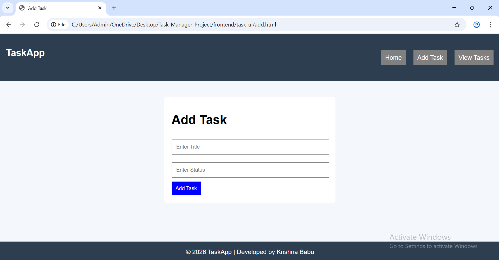
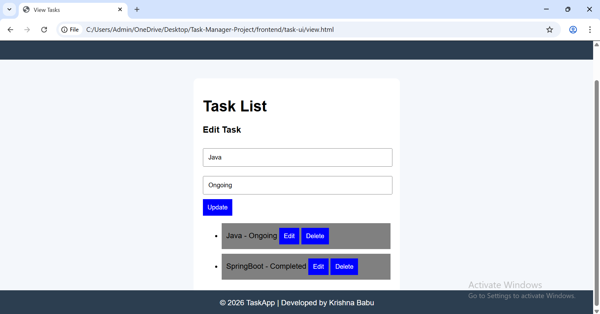
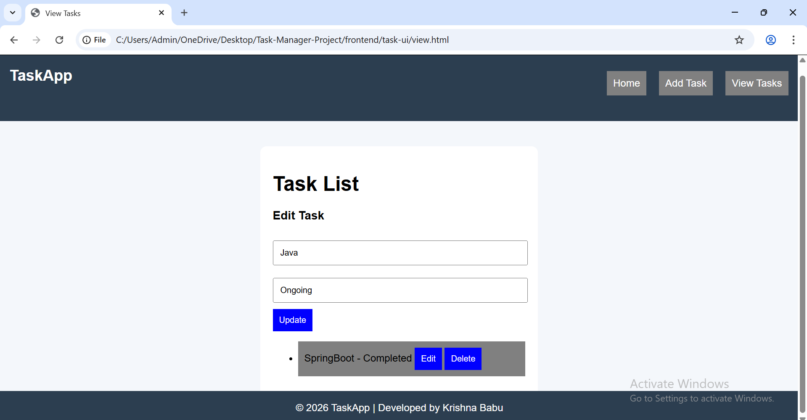
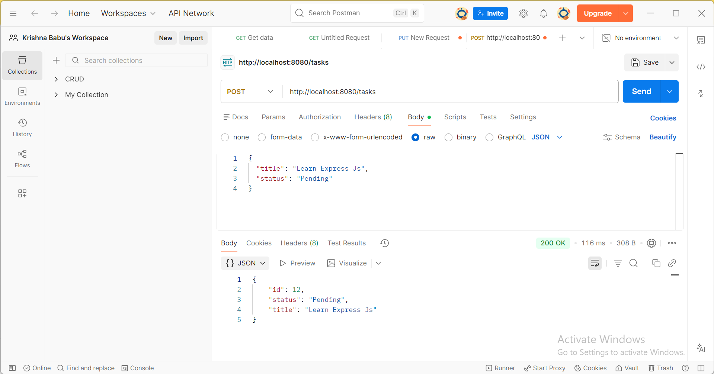

# 🚀 Task Manager Full Stack Application

## 📌 Project Description
This is a Full Stack Task Manager application built using:
- Spring Boot (Backend)
- MySQL (Database)
- HTML, CSS, JavaScript (Frontend)

The application allows users to perform CRUD operations (Create, Read, Update, Delete) on tasks.

---

## 🛠️ Tech Stack

### 🔹 Backend
- Java
- Spring Boot
- Spring Data JPA
- MySQL

### 🔹 Frontend
- HTML
- CSS
- JavaScript (Fetch API)

---

## ✨ Features

- ➕ Add Task
- 📋 View Tasks
- ✏️ Update Task
- 🗑️ Delete Task
- 🌐 Multi-page UI with Navigation Bar
- 🎨 Responsive and clean UI

---

## 📂 Project Structure
task-manager/
├── backend/ (Spring Boot Application)
└── frontend/ (HTML, CSS, JS)

---

## ⚙️ Backend Setup

1. Open project in VS Code  
2. Configure MySQL in `application.properties`:
spring.datasource.url=jdbc:mysql://localhost:3306/taskdb
spring.datasource.username=root
spring.datasource.password=root
spring.jpa.hibernate.ddl-auto=update

3. Run the application  
Backend runs on:
http://localhost:8080

---

## 🌐 Frontend Setup

1. Open `frontend` folder  
2. Run using Live Server or open `index.html`

---

## 🔗 API Endpoints

| Method | Endpoint        | Description     |
|--------|---------------|-----------------|
| GET    | /tasks        | Get all tasks   |
| POST   | /tasks        | Create task     |
| PUT    | /tasks/{id}   | Update task     |
| DELETE | /tasks/{id}   | Delete task     |

---

## 📸 Screenshots

### 🏠 Task List Page

### ➕ Add Task

### ✏️ Update Task

### 🗑️ Delete Task

### 🔗 API Testing (Postman)

## 👨‍💻 Author

- Sakalabhakthula Krishna Babu

---

## ⭐ Conclusion

This project demonstrates a complete full-stack application with frontend-backend integration using REST APIs.
